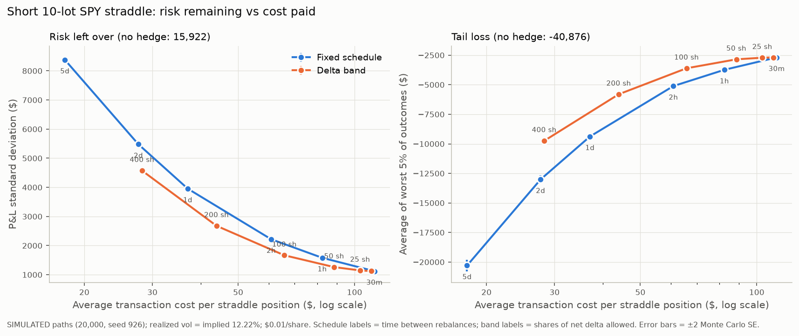

# Options Pricing and Hedging

A learning project that goes from market option quotes to risk management.

**Research question:** If I sell an option position, what risks do I take on, how can I measure them, and how much does it cost to reduce the directional exposure?

## Plan

1. **Payoffs and pricing.** Call and put payoffs, straddles, and European Black–Scholes–Merton prices.
2. **Greeks and implied volatility.** Delta, gamma, vega and theta, with numerical checks. Solving for implied volatility from a price.
3. **Real option-chain snapshot.** One timestamped SPY chain: quote quality, spreads, volatility smile and term structure.
4. **Hedging experiment.** A short at-the-money straddle on simulated price paths. It compares no hedge, hedging on a fixed schedule, and hedging when delta crosses a threshold, including transaction costs.

## Results

Full write-up: [reports/REPORT.md](reports/REPORT.md).

- **Real data:** our implied vols, built from a forward backed out of put–call parity, make same-strike call and put IVs agree to within 0.2–0.4 vol points. Yahoo's reported IVs differ by 2–4 points. Strong put skew; ATM vol rises from 11.0% (7 days) to 13.8% (84 days).
- **Hedging (simulated):** for a short 10-lot SPY straddle, daily delta hedging cut P&L standard deviation by about 75% for about $37 of costs. At matched cost, a delta-band rule had 32% lower dispersion than a fixed schedule.
- **What hedging can't fix:** if realized vol is 1.5× implied, the hedged book loses about $10.5k under every rebalancing rule. With jumps, the worst-5% loss stays around $21k even when hedging every 30 minutes.



## Layout

```
src/options_lab/   payoffs, bsm (prices + Greeks), implied_vol, chain (snapshot cleaning + IV),
                   simulate (price paths), hedging (cash ledger + policies), plotting
scripts/           fetch_snapshot, analyze_snapshot, run_hedging_experiment
tests/             pricing, IV, snapshot pipeline and hedging-ledger checks
notebooks/         01_straddle_payoff (payoff vs profit with real prices)
reports/           REPORT.md, generated tables and figures
```

## Setup

Requires [uv](https://docs.astral.sh/uv/).

```bash
uv sync                                       # create .venv with pinned dependencies
uv run python scripts/fetch_snapshot.py       # save an option-chain snapshot (run in US market hours)
uv run pytest                                 # run checks
uv run python scripts/analyze_snapshot.py     # smile, term structure, quote-quality table
uv run python scripts/run_hedging_experiment.py  # simulated hedging comparison (~30 s)
```

## Data

Option quotes come from Yahoo Finance through the unofficial `yfinance` library, for personal research use. Raw data is not committed. Simulated data is always labeled as simulated.

## Limitations

This is an educational pricing and hedging study, not a market-making simulator. It does not model queue position, adverse selection, customer flow or achievable spread capture. SPY options are American-style and physically settled, so European pricing is only an approximation for them.
